# schemver

[English](README.md) | [中文](README.zh.md) | [日本語](README.ja.md)

[](LICENSE)   [](CONTRIBUTING.md)

**2 つの JSON Schema を比較し、すべての変更を breaking（破壊的）・risky（要注意）・additive（追加的）に分類——互換性を理解した semver 判定を、パスごとの理由付きで。**


```bash
# not yet on npm — install from a checkout of this repository
npm install && npm run build && npm pack
npm install -g ./schemver-0.1.0.tgz
```

## なぜ schemver？

API やイベント Schema を扱うチームなら誰でも、「無害なはずの整理」でコンシューマーを壊した経験があるはずです：こっそり消えた enum 値、いつの間にか必須になったプロパティ、縮んだ `maxLength`。バージョン番号は勘で決まり、changelog には *minor* と書かれ、アラートは別のことを告げていました。定番ツールは肝心の問いに答えられません。汎用 JSON diff（`jsondiffpatch`、`git diff`）は*テキスト*が変わったことしか見えず、`minimum` を上げればデータを拒否し `maximum` を上げれば受け入れが増える——この 2 つが同じに見えてしまいます。OpenAPI レベルのチェッカーは API 全体の記述が対象で、イベント契約・設定フォーマット・メッセージレジストリが実際に使うのは素の JSON Schema ファイルです。schemver は互換性にとって唯一重要なもの、すなわち *Schema が受理するインスタンスの集合* だけを推論します。両 Schema を並行に走査し、各キーワードについて集合が狭まったか・広がったか・置き換わったか・静的に判定不能かを判断し、それを*誰の*データが検証を通り続けるべきか（プロデューサー？リーダー？両方？）に写像して、`major`・`minor`・`patch` の判定を 1 つ出力——各行にパス対応の理由付きです。`schemver bump --check` を CI に繋げば、「これは major が必要、理由はこれ」が議論ではなく説明可能なブロッキングゲートになります。

| | schemver | `json-schema-diff` | oasdiff / OpenAPI チェッカー | `jsondiffpatch` + 目視 |
|---|---|---|---|---|
| テキストではなくコンシューマー破壊を判定 | ✅ 中核機能 | 🟡 追加/削除のみ | ✅ OpenAPI 文書限定 | ❌ テキスト差分 |
| 素の JSON Schema ファイルを直接処理 | ✅ draft-04 以降すべて | ✅ | ❌ 完全な OpenAPI 文書が必要 | ✅ |
| すべての変更にパス単位の理由 | ✅ | ❌ | 🟡 ルール ID | ❌ |
| 正直な "risky" を含む 3 段階判定 | ✅ breaking/risky/additive | ❌ | 🟡 warn 段階 | ❌ |
| プロデューサー vs リーダーの視点 | ✅ `--mode backward/forward/full` | ❌ | 🟡 固定のリクエスト/レスポンス区分 | ❌ |
| semver 演算（`--check 1.5.0` → 却下） | ✅ 内蔵 | ❌ | ❌ | ❌ |
| `not` 極性、`$ref` 循環、draft 正規化 | ✅ | ❌ | 🟡 部分的 | ❌ |
| ランタイム依存ゼロ、完全オフライン | ✅ | ❌ | 🟡 Go バイナリ | ❌ |

<sub>比較は各ツールの 2026-07 時点の公開ドキュメントと挙動に基づく。schemver は静的解析器であり、効果が本当に判定不能な場合（正規表現の書き換え、`oneOf` 分岐の増減）は推測せず `risky` と言います——正直な限界は [docs/rules.md](docs/rules.md) を参照。</sub>

## 特徴

- **判定こそがプロダクト** — `schemver diff old.json new.json` はすべての変更を BREAKING / RISKY / ADDITIVE に振り分け、インスタンスパス、安定したルールコード、新旧の値、そして誰が困るかを平易な一文で添えます。
- **キーワード照合ではなく受理集合の推論** — 境界は方向で比較（`minimum` 0→13 は狭化、`maxItems` 10→20 は緩和）、`multipleOf` は整除性、`enum`/`const` は 1 つの値集合、`number`⊃`integer` のサブタイピング、`minimum`/`exclusiveMinimum` は単一の実効境界として扱います。
- **文脈を理解するオブジェクトルール** — 閉じたオブジェクトへのプロパティ追加は additive、開いたオブジェクトでは *risky*（以前はどんな値でも合法だった）；削除は追加プロパティ禁止なら breaking、そうでなければドリフト；サブ Schema に支配される名前はその支配 Schema と再帰的に比較します。
- **`not` を貫く極性** — `not` の内側で強化された制約は、外側 Schema の緩和として正しく報告されます；二重 `not` は打ち消し合います。素朴なツールはここで正反対の判定をします。
- **3 つの互換モード** — `backward` はプロデューサー（リクエスト/イベント Schema）、`forward` はリーダー（レスポンス Schema）、`full` は両方を保護；同じ編集でもモードにより深刻度が反転し、`--strict` は risky を breaking に格上げします。
- **semver 内蔵** — `schemver bump --current 1.4.2` は必要なバンプと次バージョンを表示；`--check 1.5.0` は提案が不足なら 1 で終了、このフラグ 1 つが CI ゲートそのものです。
- **ランタイム依存ゼロ、完全オフライン** — 必要なのは Node.js だけ；`$ref` はローカルで解決（循環含む）、外部参照はフラグ付けのみで決して取得しません。devDependency は `typescript` のみ。

## クイックスタート

同梱の例を比較——「整理リリース」が 5 か所を壊す `user.created` イベント：

```bash
# from the root of your checkout
schemver diff examples/user-v1.json examples/user-v2.json
```

出力（実際にキャプチャした実行結果）：

```text
schemver 0.1.0 — schema compatibility diff (mode: backward)

old  examples/user-v1.json · 2020-12
new  examples/user-v2.json · 2020-12 · 7 node pairs compared

BREAKING (5)
  ! /age            bound-tightened                 the lower bound tightened from >= 0 to >= 13 — values outside it are rejected
  ! /email          bound-tightened                 maxLength tightened from 320 to 254
  ! /plan           enum-values-removed             enum value "free" removed — data carrying it is rejected
  ! /referrer       property-removed-now-forbidden  property "referrer" was removed and undeclared properties are forbidden — instances carrying it are rejected
  ! /signup_source  required-added                  "signup_source" is now required — instances without it are rejected

RISKY (2)
  ? /email          format-changed                  format changed from "email" to "idn-email" — format is an annotation by default, but many validators enforce it as an assertion
  ? /plan           default-changed                 default "pro" added — validation is unaffected, but consumers that fill in the default change behavior

ADDITIVE (4)
  + /nickname       property-added                  optional property "nickname" added where the old schema forbade undeclared properties
  + /plan           enum-values-added               enum value "team" added — old consumers may not handle it
  + /signup_source  property-added                  optional property "signup_source" added where the old schema forbade undeclared properties
  + /tags           bound-relaxed                   maxItems relaxed from 10 to 20

verdict: MAJOR — 5 breaking, 2 risky, 4 additive (mode: backward)
```

終了コードは `1` なので、マージ前チェックでこのリリースを止められます。バージョン番号そのものを検問するなら、semver 演算は `bump` に任せます（実際にキャプチャした実行結果）：

```text
schemver 0.1.0 — semver verdict (mode: backward)

old  examples/user-v1.json · 2020-12
new  examples/user-v2.json · 2020-12

changes        5 breaking · 2 risky · 4 additive
required bump  major
current        1.4.2
next           2.0.0
proposed       1.5.0 — INSUFFICIENT (delivers a minor bump, major required)
```

これは `schemver bump examples/user-v1.json examples/user-v2.json --current 1.4.2 --check 1.5.0` の結果——終了コード `1`、リリースは却下。その他のシナリオ（追加のみの v2→v2.1 リリース、モード反転、`--json`）は [examples/](examples/README.md) にあります。

## コマンド

| コマンド | 内容 | 主なオプション |
|---|---|---|
| `diff <old> <new>` | パス単位の変更レポート + semver 判定、ゲート付き終了コード | `--mode`、`--strict`、`--fail-on`、`--json` |
| `bump <old> <new> --current <x.y.z>` | 必要なバンプ + 次バージョン；`--check` は不足した提案を却下 | `--check`、`--mode`、`--strict`、`--json` |
| `rules` | エンジンが発行しうる全 54 ルールコードを表示 | `--json` |

終了コードはスクリプト向き：`0` 正常、`1` ゲート発動または提案バージョン不足、`2` 用法・入力エラー。

## 互換モード

| モード | 保護対象 | 狭化は | 緩和は | 用途 |
|---|---|---|---|---|
| `backward`（デフォルト） | 既存のプロデューサー/書き手 | **breaking** | additive | リクエストボディ、イベント Schema、設定ファイル |
| `forward` | 既存のコンシューマー/読み手 | additive | **breaking** | レスポンスボディ、公開ドキュメント |
| `full` | 両方 | **breaking** | **breaking** | どちら側も遅れうる共有契約 |

すべてのモードで、置き換えられた値集合（`const` v1→v2）は breaking、判定不能な効果は risky です。`--fail-on breaking|risky|any|none` がいつ 1 で終了するかを決め、`--strict` は risky を breaking として扱います。効果/深刻度の完全な契約は [docs/rules.md](docs/rules.md) に記載しています。

## アーキテクチャ

```mermaid
flowchart LR
  IN["old + new<br/>schema JSON"] --> N["normalize<br/>(drafts · bool schemas · $ref)"]
  N --> W["parallel walker<br/>(per-keyword, per-path)"]
  W --> P["polarity tracker<br/>(not-flips)"]
  P --> E["acceptance effects<br/>(narrowed · widened · changed · unknown)"]
  E --> M["mode table<br/>(backward · forward · full)"]
  M --> C["breaking / risky / additive"]
  C --> B["semver ladder<br/>(major · minor · patch)"]
  B --> G["--fail-on / --check gate"]
  G --> OUT["text · --json · exit code"]
```



## ロードマップ

- [x] 受理効果 diff エンジン（54 ルール）、3 つの互換モード、`not` 極性、循環対応のローカル `$ref` 解決、draft-04→2020-12 正規化、`bump --check` semver ゲート、JSON 出力、91 テスト + smoke スクリプト（v0.1.0）
- [ ] PR コメントとコードスキャン向けの Markdown/SARIF 出力
- [ ] ディレクトリモード：レジストリフォルダ内の全 Schema を一括比較
- [ ] `$dynamicRef`/`$anchor` の解決とファイル横断ローカルバンドル
- [ ] オプトインのインスタンスコーパス検査：サンプルペイロードを両 Schema で再生して判定を裏付け
- [ ] パス単位の深刻度上書き（承知済みの破壊）を設定ファイルで
- [ ] npm への公開

完全なリストは [open issues](https://github.com/JaydenCJ/schemver/issues) を参照。

## コントリビュート

コントリビューション歓迎です。`npm install && npm run build` でビルドし、`npm test` と `bash scripts/smoke.sh`（`SMOKE OK` の出力が必須）を実行してください——このリポジトリは CI を持たず、上記の主張はすべてローカル実行で検証されています。[CONTRIBUTING.md](CONTRIBUTING.md) を読み、[good first issue](https://github.com/JaydenCJ/schemver/issues?q=is%3Aissue+is%3Aopen+label%3A%22good+first+issue%22) を選ぶか、[discussion](https://github.com/JaydenCJ/schemver/discussions) を始めてください。

## ライセンス

[MIT](LICENSE)
