# schemver

[English](README.md) | [中文](README.zh.md) | [日本語](README.ja.md)

[](LICENSE)   [](CONTRIBUTING.md)

**Diffs two JSON Schemas and classifies every change as breaking, risky, or additive — a compatibility-aware semver verdict with per-path reasons.**


```bash
# not yet on npm — install from a checkout of this repository
npm install && npm run build && npm pack
npm install -g ./schemver-0.1.0.tgz
```

## Why schemver?

Every API and event-schema team has shipped the "harmless cleanup" that broke consumers: an enum value quietly dropped, a property that became required, a `maxLength` that shrank. The version number was picked by gut feeling, the changelog said *minor*, and the pagers said otherwise. The tools people reach for cannot answer the actual question. A generic JSON diff (`jsondiffpatch`, `git diff`) sees that *text* changed but has no idea that raising `minimum` rejects data while raising `maximum` accepts more — the two look identical to it. OpenAPI-level checkers work on whole API surfaces, not the bare JSON Schema files that event contracts, config formats and message registries actually are. schemver reasons about the only thing that matters for compatibility: the *set of instances a schema accepts*. It walks both schemas in parallel, decides for every keyword whether the set narrowed, widened, was replaced, or is statically undecidable, maps that through *whose* data must keep validating (producers? readers? both?), and prints one verdict — `major`, `minor`, or `patch` — with a per-path reason for every line. Wire `schemver bump --check` into CI and "this requires a major bump, here is why" becomes a blocking, explainable gate instead of an argument.

| | schemver | `json-schema-diff` | oasdiff / OpenAPI checkers | `jsondiffpatch` + eyeballs |
|---|---|---|---|---|
| Judges consumer breakage, not text | ✅ the core feature | 🟡 add/remove only | ✅ for OpenAPI docs | ❌ text deltas |
| Works on bare JSON Schema files | ✅ any draft-04+ | ✅ | ❌ needs a full OpenAPI doc | ✅ |
| Per-path reasons on every change | ✅ | ❌ | 🟡 rule IDs | ❌ |
| Three-way verdict incl. honest "risky" | ✅ breaking/risky/additive | ❌ | 🟡 warn tier | ❌ |
| Producer vs. reader perspective | ✅ `--mode backward/forward/full` | ❌ | 🟡 fixed request/response split | ❌ |
| Semver arithmetic (`--check 1.5.0` → veto) | ✅ built in | ❌ | ❌ | ❌ |
| `not` polarity, `$ref` cycles, draft folding | ✅ | ❌ | 🟡 partial | ❌ |
| Zero runtime dependencies, fully offline | ✅ | ❌ | 🟡 Go binary | ❌ |

<sub>Comparison against each tool's public docs and behavior, 2026-07. schemver is a static analyzer: where an effect is genuinely undecidable (regex rewrites, `oneOf` arm churn) it says `risky` instead of guessing — see [docs/rules.md](docs/rules.md) for honest limits.</sub>

## Features

- **The verdict is the product** — `schemver diff old.json new.json` buckets every change into BREAKING / RISKY / ADDITIVE with the instance path, a stable rule code, the old/new values, and one plain sentence explaining who gets hurt.
- **Acceptance-set reasoning, not keyword matching** — bounds compare by direction (`minimum` 0→13 narrows, `maxItems` 10→20 widens), `multipleOf` by divisibility, `enum`/`const` as one value set, `number`⊃`integer` subtyping, and `minimum`/`exclusiveMinimum` as a single effective bound.
- **Context-aware object rules** — an added property is additive on a closed object but *risky* on an open one (any value was legal there before); a removed property is breaking when extras are forbidden and drift when they are not; schema-governed names diff recursively against their governing subschema.
- **Polarity through `not`** — a constraint tightened inside `not` is correctly reported as a widening of the outer schema; a double `not` cancels. Naive tools get this exactly backwards.
- **Three compatibility modes** — `backward` protects producers (request/event schemas), `forward` protects readers (response schemas), `full` protects both; the same edit flips severity between them, and `--strict` promotes risky to breaking.
- **Semver built in** — `schemver bump --current 1.4.2` prints the required bump and next version; `--check 1.5.0` exits 1 when the proposal under-delivers, which is the whole CI gate in one flag.
- **Zero runtime dependencies, fully offline** — Node.js is the only requirement; `$ref`s are resolved locally (cycles included) and external refs are flagged, never fetched. `typescript` is the sole devDependency.

## Quickstart

Diff the bundled examples — a `user.created` event whose "cleanup release" breaks five things:

```bash
# from the root of your checkout
schemver diff examples/user-v1.json examples/user-v2.json
```

Output (real captured run):

```text
schemver 0.1.0 — schema compatibility diff (mode: backward)

old  examples/user-v1.json · 2020-12
new  examples/user-v2.json · 2020-12 · 7 node pairs compared

BREAKING (5)
  ! /age            bound-tightened                 the lower bound tightened from >= 0 to >= 13 — values outside it are rejected
  ! /email          bound-tightened                 maxLength tightened from 320 to 254
  ! /plan           enum-values-removed             enum value "free" removed — data carrying it is rejected
  ! /referrer       property-removed-now-forbidden  property "referrer" was removed and undeclared properties are forbidden — instances carrying it are rejected
  ! /signup_source  required-added                  "signup_source" is now required — instances without it are rejected

RISKY (2)
  ? /email          format-changed                  format changed from "email" to "idn-email" — format is an annotation by default, but many validators enforce it as an assertion
  ? /plan           default-changed                 default "pro" added — validation is unaffected, but consumers that fill in the default change behavior

ADDITIVE (4)
  + /nickname       property-added                  optional property "nickname" added where the old schema forbade undeclared properties
  + /plan           enum-values-added               enum value "team" added — old consumers may not handle it
  + /signup_source  property-added                  optional property "signup_source" added where the old schema forbade undeclared properties
  + /tags           bound-relaxed                   maxItems relaxed from 10 to 20

verdict: MAJOR — 5 breaking, 2 risky, 4 additive (mode: backward)
```

The exit code is `1`, so a pre-merge check can block the release. To gate a version number instead, let `bump` do the semver arithmetic (real captured run):

```text
schemver 0.1.0 — semver verdict (mode: backward)

old  examples/user-v1.json · 2020-12
new  examples/user-v2.json · 2020-12

changes        5 breaking · 2 risky · 4 additive
required bump  major
current        1.4.2
next           2.0.0
proposed       1.5.0 — INSUFFICIENT (delivers a minor bump, major required)
```

That was `schemver bump examples/user-v1.json examples/user-v2.json --current 1.4.2 --check 1.5.0` — exit `1`, release vetoed. More scenarios (the additive v2→v2.1 release, mode flips, `--json`) live in [examples/](examples/README.md).

## Commands

| Command | Does | Key options |
|---|---|---|
| `diff <old> <new>` | per-path change report with a semver verdict, gated exit code | `--mode`, `--strict`, `--fail-on`, `--json` |
| `bump <old> <new> --current <x.y.z>` | required bump + next version; `--check` vetoes an insufficient proposal | `--check`, `--mode`, `--strict`, `--json` |
| `rules` | print all 54 rule codes the engine can emit | `--json` |

Exit codes are script-friendly: `0` ok, `1` the gate tripped or the proposed version under-delivers, `2` usage or input error.

## Compatibility modes

| Mode | Protects | Narrowing is | Widening is | Use for |
|---|---|---|---|---|
| `backward` *(default)* | old producers/writers | **breaking** | additive | request bodies, event schemas, config files |
| `forward` | old consumers/readers | additive | **breaking** | response bodies, published documents |
| `full` | both sides | **breaking** | **breaking** | shared contracts where either side may lag |

In every mode, a replaced value set (`const` v1→v2) is breaking and an undecidable effect is risky. `--fail-on breaking|risky|any|none` picks what exits 1; `--strict` treats risky as breaking. The full effect/severity contract is documented in [docs/rules.md](docs/rules.md).

## Architecture

```mermaid
flowchart LR
  IN["old + new<br/>schema JSON"] --> N["normalize<br/>(drafts · bool schemas · $ref)"]
  N --> W["parallel walker<br/>(per-keyword, per-path)"]
  W --> P["polarity tracker<br/>(not-flips)"]
  P --> E["acceptance effects<br/>(narrowed · widened · changed · unknown)"]
  E --> M["mode table<br/>(backward · forward · full)"]
  M --> C["breaking / risky / additive"]
  C --> B["semver ladder<br/>(major · minor · patch)"]
  B --> G["--fail-on / --check gate"]
  G --> OUT["text · --json · exit code"]
```



## Roadmap

- [x] Acceptance-effect diff engine (54 rules), three compatibility modes, `not` polarity, local `$ref` resolution with cycle breaking, draft-04→2020-12 folding, `bump --check` semver gate, JSON output, 91 tests + smoke script (v0.1.0)
- [ ] Markdown/SARIF output for PR comments and code-scanning dashboards
- [ ] Directory mode: diff every schema in a registry folder in one run
- [ ] `$dynamicRef`/`$anchor` resolution and cross-file local bundles
- [ ] An opt-in instance corpus check: replay sample payloads against both schemas to confirm verdicts
- [ ] Config file for per-path severity overrides (acknowledged breaks)
- [ ] Publish to npm

See the [open issues](https://github.com/JaydenCJ/schemver/issues) for the full list.

## Contributing

Contributions are welcome. Build with `npm install && npm run build`, then run `npm test` and `bash scripts/smoke.sh` (must print `SMOKE OK`) — this repository ships no CI, every claim above is verified by local runs. See [CONTRIBUTING.md](CONTRIBUTING.md), grab a [good first issue](https://github.com/JaydenCJ/schemver/issues?q=is%3Aissue+is%3Aopen+label%3A%22good+first+issue%22), or start a [discussion](https://github.com/JaydenCJ/schemver/discussions).

## License

[MIT](LICENSE)
