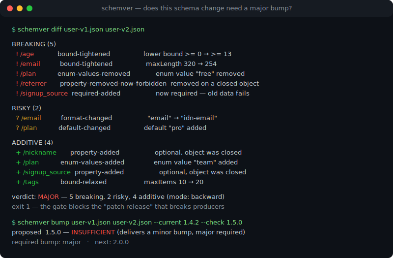

# schemver

[English](README.md) | [中文](README.zh.md) | [日本語](README.ja.md)

[](LICENSE)   [](CONTRIBUTING.md)

**对比两份 JSON Schema，把每处变更分类为 breaking（破坏）、risky（风险）或 additive（新增）——兼容性感知的 semver 裁决，每条路径都附理由。**



```bash
# not yet on npm — install from a checkout of this repository
npm install && npm run build && npm pack
npm install -g ./schemver-0.1.0.tgz
```

## 为什么选 schemver？

每个 API 和事件 Schema 团队都发布过那种"无害的清理"却弄坏了消费者：一个悄悄删掉的枚举值、一个突然变成必填的属性、一个缩小的 `maxLength`。版本号凭直觉拍板，changelog 写着 *minor*，而告警说的是另一回事。大家惯用的工具回答不了真正的问题。通用 JSON diff（`jsondiffpatch`、`git diff`）只看到*文本*变了，完全不知道抬高 `minimum` 是在拒绝数据、抬高 `maximum` 是在接受更多——这两者在它眼里一模一样。OpenAPI 级别的检查器面向完整 API 描述，而事件契约、配置格式和消息注册表用的恰恰是裸 JSON Schema 文件。schemver 只推理对兼容性唯一重要的东西：*一份 Schema 接受的实例集合*。它并行遍历两份 Schema，对每个关键字判断集合是收窄了、放宽了、被替换了、还是静态不可判定，再映射到*谁的*数据必须继续通过校验（生产者？读取者？双方？），最后打印一个裁决——`major`、`minor` 或 `patch`——每一行都有对应路径的理由。把 `schemver bump --check` 接进 CI，"这需要一个 major 版本，理由如下"就从一场争论变成一道可解释的强制门禁。

| | schemver | `json-schema-diff` | oasdiff / OpenAPI 检查器 | `jsondiffpatch` + 人眼 |
|---|---|---|---|---|
| 判断消费者破坏，而非文本 | ✅ 核心能力 | 🟡 仅增删 | ✅ 限 OpenAPI 文档 | ❌ 文本差异 |
| 直接处理裸 JSON Schema 文件 | ✅ 任意 draft-04+ | ✅ | ❌ 需要完整 OpenAPI 文档 | ✅ |
| 每处变更都有路径级理由 | ✅ | ❌ | 🟡 规则 ID | ❌ |
| 三档裁决且诚实标注 "risky" | ✅ breaking/risky/additive | ❌ | 🟡 warn 档 | ❌ |
| 生产者 vs 读取者视角 | ✅ `--mode backward/forward/full` | ❌ | 🟡 固定的请求/响应划分 | ❌ |
| semver 运算（`--check 1.5.0` → 否决） | ✅ 内置 | ❌ | ❌ | ❌ |
| `not` 极性、`$ref` 环、draft 归一化 | ✅ | ❌ | 🟡 部分 | ❌ |
| 零运行时依赖，完全离线 | ✅ | ❌ | 🟡 Go 二进制 | ❌ |

<sub>对比基于各工具 2026-07 的公开文档与行为。schemver 是静态分析器：当效果确实不可判定（正则重写、`oneOf` 分支增删）时，它会说 `risky` 而不是瞎猜——诚实的边界见 [docs/rules.md](docs/rules.md)。</sub>

## 特性

- **裁决即产品** — `schemver diff old.json new.json` 把每处变更归入 BREAKING / RISKY / ADDITIVE，附实例路径、稳定的规则代码、新旧取值，以及一句大白话说明谁会受伤。
- **推理接受集合，而非匹配关键字** — 边界按方向比较（`minimum` 0→13 收窄，`maxItems` 10→20 放宽），`multipleOf` 按整除性，`enum`/`const` 视为同一个取值集合，`number`⊃`integer` 子类型，`minimum`/`exclusiveMinimum` 合并为单一有效边界。
- **上下文感知的对象规则** — 在封闭对象上新增属性是 additive，在开放对象上却是 *risky*（那里以前任何值都合法）；删除属性在禁止额外属性时是 breaking，否则是漂移；受子 Schema 管辖的名字会递归对比其管辖 Schema。
- **穿透 `not` 的极性** — 在 `not` 内部收紧的约束会被正确报告为外层 Schema 的放宽；双重 `not` 相互抵消。朴素工具在这里恰好判反。
- **三种兼容模式** — `backward` 保护生产者（请求/事件 Schema），`forward` 保护读取者（响应 Schema），`full` 双向保护；同一处修改在不同模式下严重度翻转，`--strict` 把 risky 升格为 breaking。
- **内置 semver** — `schemver bump --current 1.4.2` 打印所需升级和下一个版本号；`--check 1.5.0` 在提案不够格时以 1 退出，一个 flag 就是完整的 CI 门禁。
- **零运行时依赖，完全离线** — 只需要 Node.js；`$ref` 在本地解析（含环），外部引用只标记、绝不抓取。`typescript` 是唯一的 devDependency。

## 快速上手

对比内置示例——一个 `user.created` 事件，它的"清理版本"弄坏了五处：

```bash
# from the root of your checkout
schemver diff examples/user-v1.json examples/user-v2.json
```

输出（真实捕获的运行结果）：

```text
schemver 0.1.0 — schema compatibility diff (mode: backward)

old  examples/user-v1.json · 2020-12
new  examples/user-v2.json · 2020-12 · 7 node pairs compared

BREAKING (5)
  ! /age            bound-tightened                 the lower bound tightened from >= 0 to >= 13 — values outside it are rejected
  ! /email          bound-tightened                 maxLength tightened from 320 to 254
  ! /plan           enum-values-removed             enum value "free" removed — data carrying it is rejected
  ! /referrer       property-removed-now-forbidden  property "referrer" was removed and undeclared properties are forbidden — instances carrying it are rejected
  ! /signup_source  required-added                  "signup_source" is now required — instances without it are rejected

RISKY (2)
  ? /email          format-changed                  format changed from "email" to "idn-email" — format is an annotation by default, but many validators enforce it as an assertion
  ? /plan           default-changed                 default "pro" added — validation is unaffected, but consumers that fill in the default change behavior

ADDITIVE (4)
  + /nickname       property-added                  optional property "nickname" added where the old schema forbade undeclared properties
  + /plan           enum-values-added               enum value "team" added — old consumers may not handle it
  + /signup_source  property-added                  optional property "signup_source" added where the old schema forbade undeclared properties
  + /tags           bound-relaxed                   maxItems relaxed from 10 to 20

verdict: MAJOR — 5 breaking, 2 risky, 4 additive (mode: backward)
```

退出码是 `1`，合并前检查即可拦下这次发布。若要把关版本号本身，让 `bump` 来做 semver 运算（真实捕获的运行结果）：

```text
schemver 0.1.0 — semver verdict (mode: backward)

old  examples/user-v1.json · 2020-12
new  examples/user-v2.json · 2020-12

changes        5 breaking · 2 risky · 4 additive
required bump  major
current        1.4.2
next           2.0.0
proposed       1.5.0 — INSUFFICIENT (delivers a minor bump, major required)
```

上面这条是 `schemver bump examples/user-v1.json examples/user-v2.json --current 1.4.2 --check 1.5.0`——退出码 `1`，发布被否决。更多场景（纯新增的 v2→v2.1 发布、模式翻转、`--json`）见 [examples/](examples/README.md)。

## 命令

| 命令 | 作用 | 关键选项 |
|---|---|---|
| `diff <old> <new>` | 路径级变更报告 + semver 裁决，带门禁退出码 | `--mode`、`--strict`、`--fail-on`、`--json` |
| `bump <old> <new> --current <x.y.z>` | 所需升级 + 下一个版本号；`--check` 否决不够格的提案 | `--check`、`--mode`、`--strict`、`--json` |
| `rules` | 打印引擎可产生的全部 54 条规则代码 | `--json` |

退出码对脚本友好：`0` 正常，`1` 门禁触发或提案版本不够格，`2` 用法或输入错误。

## 兼容模式

| 模式 | 保护对象 | 收窄意味着 | 放宽意味着 | 适用于 |
|---|---|---|---|---|
| `backward`（默认） | 旧的生产者/写方 | **breaking** | additive | 请求体、事件 Schema、配置文件 |
| `forward` | 旧的消费者/读方 | additive | **breaking** | 响应体、对外发布的文档 |
| `full` | 双方 | **breaking** | **breaking** | 任一方都可能滞后的共享契约 |

在所有模式下，被替换的取值集合（`const` v1→v2）都是 breaking，不可判定的效果都是 risky。`--fail-on breaking|risky|any|none` 决定何时以 1 退出；`--strict` 把 risky 当作 breaking。完整的效果/严重度契约见 [docs/rules.md](docs/rules.md)。

## 架构

```mermaid
flowchart LR
  IN["old + new<br/>schema JSON"] --> N["normalize<br/>(drafts · bool schemas · $ref)"]
  N --> W["parallel walker<br/>(per-keyword, per-path)"]
  W --> P["polarity tracker<br/>(not-flips)"]
  P --> E["acceptance effects<br/>(narrowed · widened · changed · unknown)"]
  E --> M["mode table<br/>(backward · forward · full)"]
  M --> C["breaking / risky / additive"]
  C --> B["semver ladder<br/>(major · minor · patch)"]
  B --> G["--fail-on / --check gate"]
  G --> OUT["text · --json · exit code"]
```



## 路线图

- [x] 接受效果 diff 引擎（54 条规则）、三种兼容模式、`not` 极性、带断环的本地 `$ref` 解析、draft-04→2020-12 归一化、`bump --check` semver 门禁、JSON 输出、91 个测试 + smoke 脚本（v0.1.0）
- [ ] Markdown/SARIF 输出，用于 PR 评论和代码扫描面板
- [ ] 目录模式：一次运行对比注册表文件夹里的全部 Schema
- [ ] `$dynamicRef`/`$anchor` 解析与跨文件本地 bundle
- [ ] 可选的实例语料校验：用样例载荷回放两份 Schema 以印证裁决
- [ ] 配置文件支持按路径覆盖严重度（已知悉的破坏）
- [ ] 发布到 npm

完整列表见 [open issues](https://github.com/JaydenCJ/schemver/issues)。

## 参与贡献

欢迎贡献。先 `npm install && npm run build` 构建，然后运行 `npm test` 和 `bash scripts/smoke.sh`（必须打印 `SMOKE OK`）——本仓库不带 CI，上面的每一条声明都由本地运行验证。参阅 [CONTRIBUTING.md](CONTRIBUTING.md)，认领一个 [good first issue](https://github.com/JaydenCJ/schemver/issues?q=is%3Aissue+is%3Aopen+label%3A%22good+first+issue%22)，或发起一个 [discussion](https://github.com/JaydenCJ/schemver/discussions)。

## 许可证

[MIT](LICENSE)
